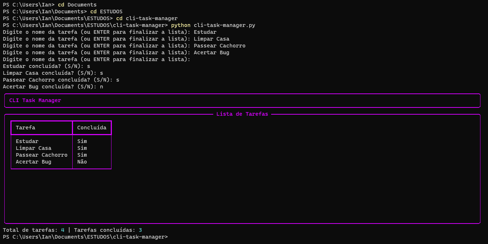

# CLI Task Manager
CLI Task Manager é um aplicativo de gerenciamento de tarefas simples e interativo que roda na linha de comando. Com ele, é possível adicionar tarefas à sua lista, marcar tarefas como concluídas e visualizar um resumo final em forma de tabela de todas elas.

## Como usar
Para usar o CLI Task Manager, basta baixar o código e executá-lo em seu terminal. Certifique-se de ter Python 3 e o pacote Rich instalados em seu sistema antes de rodar o aplicativo.

O aplicativo começará solicitando que você adicione tarefas à sua lista. Digite o nome de cada tarefa quando solicitado. Quando você terminar de adicionar todas, simplesmente pressione ENTER sem digitar nenhum texto para continuar.

Para cada tarefa, você será solicitado a indicar se ela foi concluída ou não. Digite 'S' para sim ou 'N' para não. Se você digitar qualquer outra coisa, o aplicativo solicitará novamente que você indique se a tarefa foi concluída ou não.

Depois de inserir todas as tarefas e seus status, o aplicativo exibirá uma tabela com a lista de tarefas e se cada uma foi concluída ou não. O aplicativo também exibirá um resumo com o número total de tarefas e o número das que foram concluídas. Para sair do programa, basta pressionar CTRL-C ou fechar a janela do terminal.

## Dependências
O CLI Task Manager foi desenvolvido em Python 3 e usa o pacote Rich para formatar a saída na linha de comando. 
`pip install rich`

## Contribuindo
Contribuições são bem-vindas! Sinta-se à vontade para enviar pull requests com correções de bugs ou melhorias no código.

